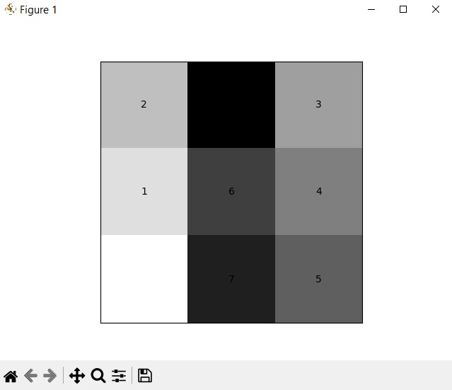
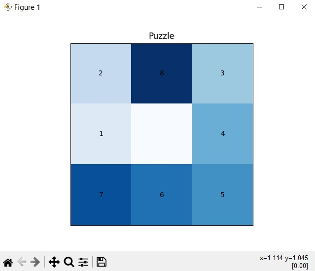

# ESCUELA POLITÉCNICA NACIONAL

---

**Integrantes:**

- Simbaña Ivan
- Suntasig Ariel
- Terán José
- Torres Jeremy
- Verdezoto José
- Yanez David

---

# PROTOTIPOS

## 1. Descripción del Proyecto

- Este proyecto resuelve un rompecabezas deslizante de 8 fichas utilizando el algoritmo de búsqueda primero en anchura (BFS) para encontrar la solución. Está compuesto por varias clases y utiliza la librería NumPy y Matplotlib para manipular matrices y visualizar el estado del rompecabezas.

## 2. Prototipo Inicial

- En esta imagen podemos visualizar una interfaz básica de nuestro puzzle con una calidad de imagen en blanco y negro, un poco difícil de distinguir los colores con sus tonalidades.

## 3. Prototipo Iterativo

- En esta imagen podemos visualizar una mejora notable en la interfaz, con una tonalidad y mezcla de colores vivos para un mejor entendimiento del funcionamiento del puzzle para el usuario.

